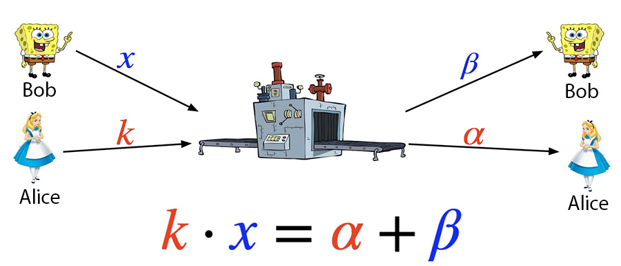
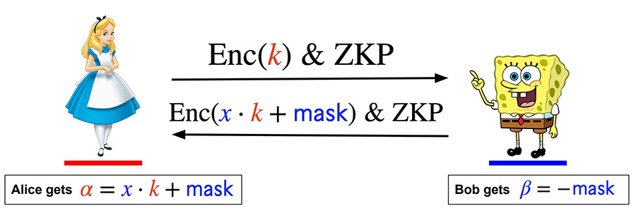
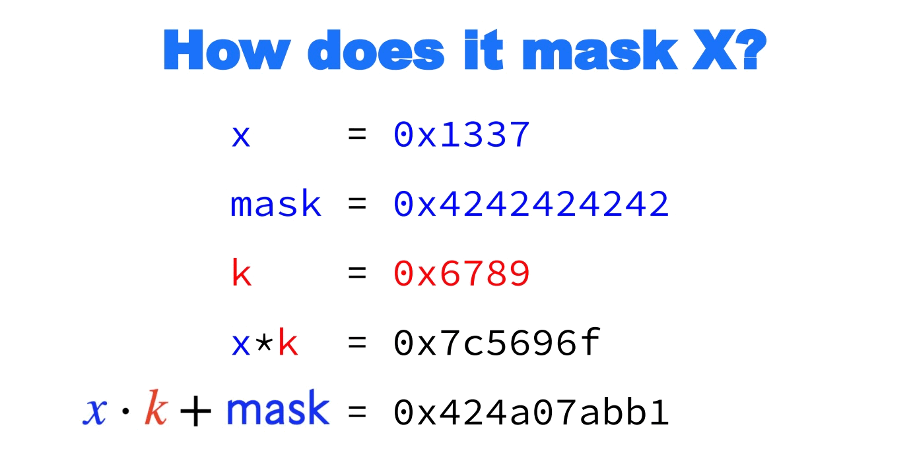
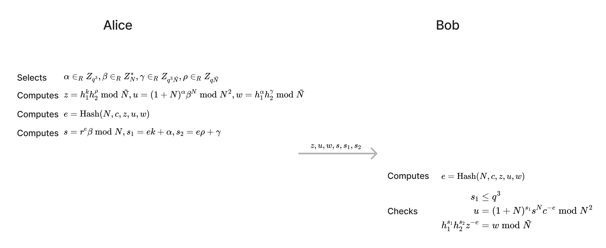

# GG18/GG20 协议漏洞 CVE-2023-33241 分析
最近，Fireblocks 团队在论文 [Practical Key-Extraction Attacks in Leading MPC Wallets](https://eprint.iacr.org/2023/1234) 中公开了 ECDSA 门限签名协议 GG18/GG20 的一个漏洞（[CVE-2023-33241](https://nvd.nist.gov/vuln/detail/CVE-2023-33241)），利用这个漏洞，恶意参与者通过 16 次签名就可以窃取其他参与者的私钥分片。

本文以两个参与者为例，介绍这个漏洞的细节。两个参与者分别为 Alice 和 Bob，其中 Alice 是攻击者，Bob 是诚实的参与者。

# 预备知识
在介绍漏洞的细节前，这节先介绍一些预备知识，以帮助理解后续的内容。

## Paillier 同态加密
[Paillier](https://en.wikipedia.org/wiki/Paillier_cryptosystem) 加密算法是一种非对称加密算法，且具有加同态的特性。

Paillier 密钥对生成：选择 $p,q$ 两个素数，它们满足条件 $pq$ 和 $(p-1)(q-1)$ 互素。 $N=pq$ 就是公钥，而 $(p,q)$ 是私钥。

Paillier 加密过程：小于 $N$ 的整数中随机选择一个 $r$ ，记明文为 $m$ ，密文计算公式为 $c = (1+N)^m r^N \bmod N^2$ 。

Paillier 解密过程：记密文为 $c$ ，则明文计算公式为 $m = \lfloor \frac{(c^{\varphi (n)} \bmod N^2) - 1}{N} \rfloor \cdot \varphi (n)^{-1}\bmod N$ ，其中 $\varphi (n)=(p-1)(q-1)$ 。

## MtA 子协议
在 GG18/GG20 的 MPC 签名协议中有个名为 Multiplicative-to-Additive（后文简称它为 MtA）的子协议。

MtA 子协议结束后，会满足 $k \cdot x = \alpha + \beta$ ，这正是 Multiplicative-to-Additive 名称的由来，也就是这个协议把秘密值的乘积转移成了秘密值的和。其中， $x$ 是 Bob 的私钥分片。如果值 $x$ 被 Alice 知道了，则 Alice 可以恢复出完整的私钥。 **漏洞 CVE-2023-33241 的思路就是 Alice 想方设法得到 Bob 的私钥分片 $x$ 。**

在 GG18/GG20 中，实现 MtA 子协议时使用了 Paillier 同态加密。

其中 Alice 在计算 $\text{Enc}(k)$ 时会用到 Alice 自己的 Paillier 公钥 $N$ 。Alice 在解密 $\text{Enc}(x \cdot k - \beta)$ 时会用到自己的 Paillier 私钥。Alice 的 Paillier 密钥对是在 GG18/GG20 协议的 DKG 阶段生成的。

## 中国剩余定理
《孙子算经》中有个“物不知数”问题：
> 有物不知其数，三三数之剩二，五五数之剩三，七七数之剩二。问物几何？

一个整数除以三余二，除以五余三，除以七余二，求这个整数。利用中国剩余定理可以算出这个满足条件的最小数为 23。

后面会介绍，Alice 可以获得 Bob 的私钥分片 $x$ 除以 $p_1,\cdots,p_{16}$ 的各个余数，利用中国剩余定理可以求出 $x$ 。

# 漏洞原理
本节介绍 CVE-2023-33241 的基本原理。

## 加大 k 让 Bob 私钥分片泄露
在 MtA 子协议中，Alice 会随机选择一个 $k$ 值，使用她自己的 Paillier 公钥 $N$ 加密后，发送给 Bob。 $k$ 值不能太大，否则 Bob 的私钥分片会被泄露。所以，在 MtA 子协议中要求 Alice 提供 $k \le q^3$ 的范围证明。

下面演示一下为什么 Alice 的 $k$ 值较大时，Bob 的私钥分片 $x$ 会被泄露。先看 $k$ 比较小时的情况。

再看 $k$ 比较大时的情况。

显然，加大 $k$ 让 mask 失效，Bob 私钥分片 $x$ 的信息被泄露。

在 CVE-2023-33241 攻击中，Alice 把 $k$ 加大到一个较大值（ $k=\frac{N}{p_i}$ ，其中 $p_i$ 是公钥 $N$ 的 16 比特位长度的小因子），盗走 $x$ 的部分信息，再利用后面介绍的方法可以伪造 Range Proof；在多次签名中重复这个攻击，每次签名都盗走 $x$ 的部分信息；最后 Alice 利用中国剩余定理可以求出完整的 $x$ 。

## 伪造 Range Proof
MtA 子协议中，Alice 需要提供 Range Proof 来证明她发送给 Bob 的密文 $\text{Enc}(k)$ 所对应明文比较小（ $k \le q^3$ ），即不泄露 $k$ 时证明 $k$ 比较小。下面是 GG18/GG20 中的 Range Proof（ $N$ 是 2048 比特位， $q$ 是 256 比特位）。

如果 Bob 校验图中右下脚的 3 个式子都成立，则 Bob 就相信 Alice 发送给它的密文 $\text{Enc}(k)$ 所对应明文 $k$ 会满足 $k \le q^3$ 。

当 Alice 设置 $k=\frac{N}{p_i}$ 时，由于 $N$ 是 2048 比特位数， $p_i$ 是 16 比特位数，所以这个 $k$ 是 2032 比特位数，超过了 $q^3$ 的比特位数，无法通过 Range Proof。

下面介绍一种方法来伪造 Range Proof。

伪造 Range Proof 的关键在于，Alice 使用 $k=0$ 来创建 Range Proof（这样 Bob 校验 $s_1 \le q^3$ 时不会发现异常了），但由于 Bob 手头的 $c$ 是 $k=\frac{N}{p_i}$ 的密文，所以 Bob 校验 $u = (1+N)^{s_1}s^Nc^{-e} \bmod N^2$ 时，会发现不成立。Alice 如果想办法让 $c_{k=\frac{N}{p_i}}^{e} = c_{k=0}^{e} \bmod N^2$ （其中 $c_{k=\frac{N}{p_i}}$ 表示 $\frac{N}{p_i}$ 的 Paillier 密文， $c_{k=0}$ 表示 $0$ 的 Paillier 密文），那 Bob 校验时就无法发现异常了。

Fireblocks 团队指出当 $e \bmod p_i = 0$ （即 $e=n p_i$ ，其中 $n$ 是整数）时， $c_{k=\frac{N}{p_i}}^{e} = c_{k=0}^{e} \bmod N^2$ 会成立。下面来推导一下（推导中为了简洁省略了最外层的 $\bmod N^2$ ）：

$$\begin{aligned} c_{k=\frac{N}{p_i}}^{e} &= \left( (1+N)^{\frac{N}{p_i}} r^N \bmod N^2 \right)^e \\
&= (1+N)^{\frac{N}{p_i} \cdot n p_i} r^{Ne} \bmod N^2 \\
&= ((1+N)^{Nn} \bmod N^2)(r^{Ne} \bmod N^2) \\
&= (1+NNn \bmod N^2)(r^{Ne} \bmod N^2) \\
&= r^{Ne} \bmod N^2 \end{aligned}$$

上面推导的倒数第二步利用了 $(1+N)^{x} \bmod N^2 = 1+Nx \bmod N^2$ ，这是因为由二项式定理有 $(1+N)^{x}=1+Nx+{x \choose 2}N^{2}+{\text{higher powers of }}N$

而

$$\begin{aligned} c_{k=0}^{e} &= \left( (1+N)^0 r^N \bmod N^2 \right)^e \\
&= r^{Ne} \bmod N^2 \end{aligned}$$

从而有 $c_{k=\frac{N}{p_i}}^{e} = c_{k=0}^{e} \bmod N^2$ 。

现在剩下的问题是如何让 $e \bmod p_i = 0$ 成立呢？这可以通过暴力搜索随机数 $\gamma$ （暴力搜索 Alice 控制的其它随机数也行）的值，直到满足条件 $e \bmod p_i = 0$ ，这样的暴力搜索很容易成功，因为 $p_i$ 比较小，只有 16 个比特位。

# 漏洞利用流程
下面是 CVE-2023-33241 的利用流程：
1. 在 DKG 阶段，Alice 恶意构造 Paillier 公钥 $N=p_1 \cdots p_{16} \cdot q$ ，其中 $p_1,\cdots,p_{16}$ 都是 16 个比特位的小素数；
2. 进行 16 次 MPC 签名，每次签名的 MtA 子协议中：
    1. Alice 不随机生成 $k$ ，而是设置 $k=\frac{N}{p_i}$ 。Alice 不做恶时， $k$ 是 256 比特位数；Alice 做恶使用 $k=\frac{N}{p_i}$ 时，由于 $N$ 是 2048 比特位数， $p_i$ 是 16 比特位数，所以这个 $k$ 是 2032 比特位数，要远大于正常值，不满足 Range Proof 要求，需要后续步骤来伪造 Range Proof；
    2. Alice 伪造 Range Proof。具体方法是，Alice 设置 $k=0$ （这样才可以通过 $s_1 \le q^3$ 的校验），通过暴力搜索随机数 $\gamma$ （暴力搜索 Alice 控制的其它随机数也行）的值，直到满足条件 $e \bmod p_i = 0$ ，这样的暴力搜索很容易成功，因为 $p_i$ 比较小，只有 16 个比特位；
    3. MtA 结束后，Alice 利用公式 $x \bmod p_i = \frac{\alpha - (\alpha \bmod (N/p_i))}{N/p_i}$ ，得到 $x \bmod p_i$
3. 步骤 2 结束后，可以得到 16 个值 $x \bmod p_1, \cdots, x \bmod p_{16}$ ，再利用中国剩余定理计算出 Bob 的私钥分片 $x$

关于公式 $x \bmod p_i = \frac{\alpha - (\alpha \bmod (N/p_i))}{N/p_i}$ 的证明，可参考论文 [Practical Key-Extraction Attacks in Leading MPC Wallets](https://eprint.iacr.org/2023/1234.pdf) 中 “Claim 4.10.”。

# 漏洞修复方法
下面是 CVE-2023-33241 的修复方法：每个参与者创建 Paillier 公钥 $N$ 时，需要创建两个零知识证明，以向其它参与者证明 $N$ 满足条件：
1. $N$ 是两个素数 $pq$ 的乘积，且 $pq$ 和 $(p-1)(q-1)$ 互素（这是正常 Paillier 公钥会满足的条件）。
2. $N$ 没有小因子。

每个参与者收到其它参与者发来的 $N$ 时，要校验 $N$ 是否满足上面两个条件。

这两个零知识证明在 [CMP](https://eprint.iacr.org/2020/492.pdf)/[CGGMP](https://eprint.iacr.org/2021/060.pdf) 论文中都可以找到，分别对应 CMP/CGGMP 论文中的 Paillier-Blum Modulus ZK 和 No Small Factor Proof。

# 参考文献
1. [Practical Key-Extraction Attacks in Leading MPC Wallets](https://eprint.iacr.org/2023/1234.pdf)
2. [Fast Multiparty Threshold ECDSA with Fast Trustless Setup](https://eprint.iacr.org/2019/114.pdf)
3. https://i.blackhat.com/BH-US-23/Presentations/US-23-Makriyannis-Small-Leaks-Billions-Of-Dollars.pdf
4. https://github.com/fireblocks-labs/safeheron-gg20-exploit-poc
5. [UC Non-Interactive, Proactive, Threshold ECDSA](https://eprint.iacr.org/2020/492.pdf)
6. [UC Non-Interactive, Proactive, Threshold ECDSA with Identifiable Aborts](https://eprint.iacr.org/2021/060.pdf)
