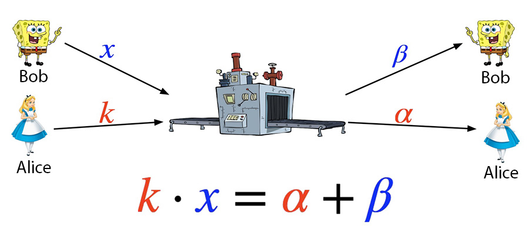
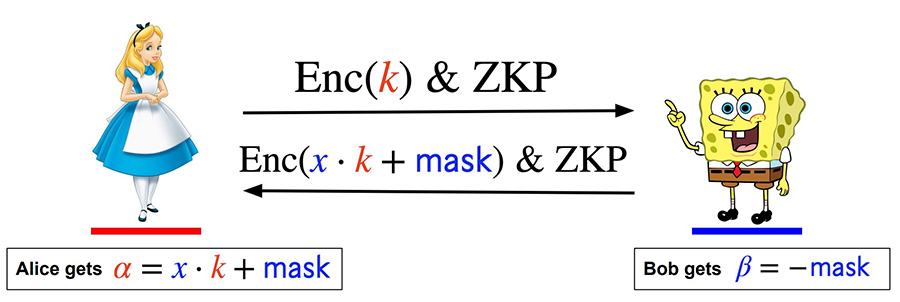
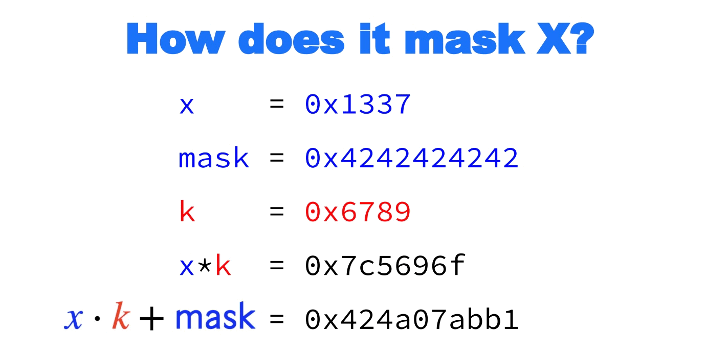
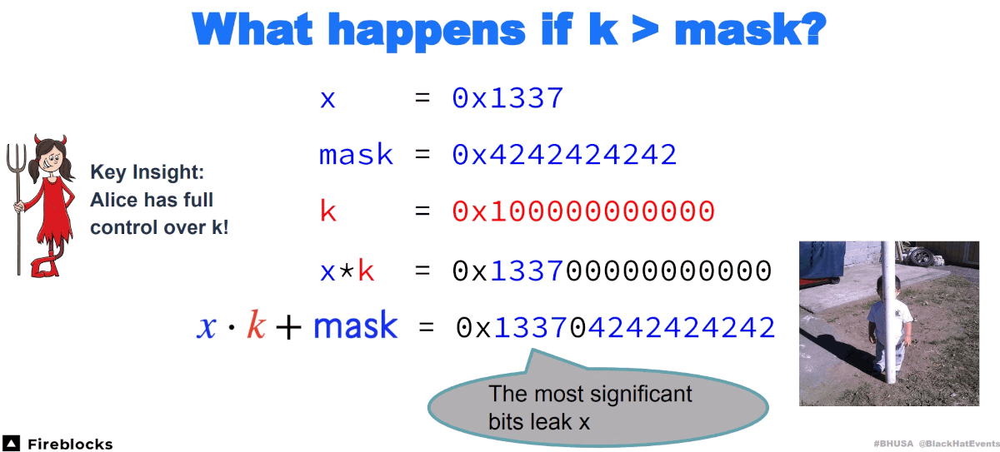
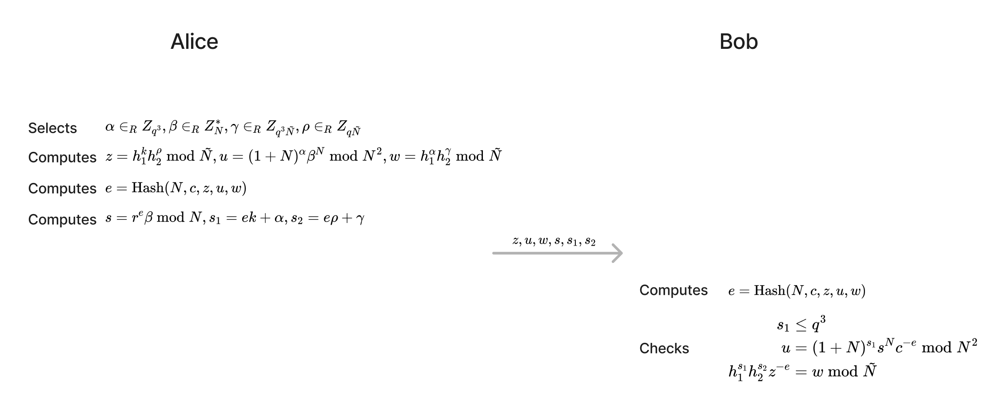
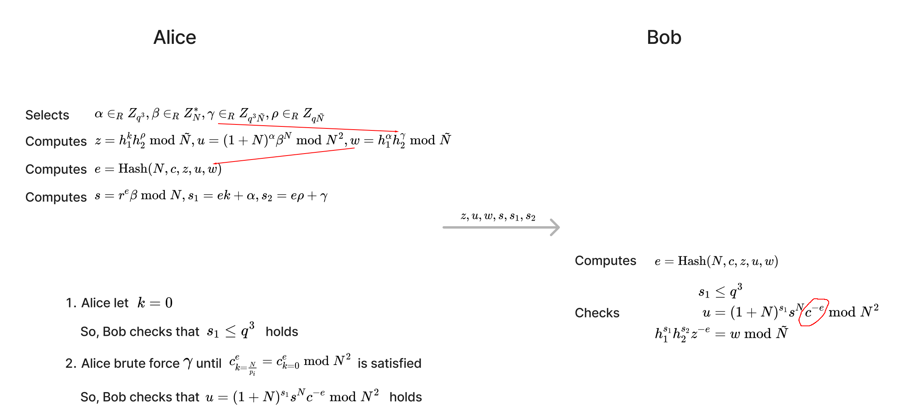

# Analysis of GG18/GG20 Protocol Vulnerability CVE-2023-33241
Recently, the Fireblocks team disclosed a vulnerability in the ECDSA threshold signature protocol GG18/GG20 in the paper [Practical Key-Extraction Attacks in Leading MPC Wallets](https://eprint.iacr.org/2023/1234)  (CVE-2023-33241). By exploiting this vulnerability, a malicious participant can steal other participants' key share with only 16 signatures.

This article describes the details of the vulnerability with two participants, Alice and Bob, where Alice is the attacker and Bob is an honest participant.

# Preliminaries
Before describing the details of the vulnerability, some preliminaries are introduced to aid in understanding the follow-up content.

## Paillier Homomorphic Encryption
[Paillier](https://en.wikipedia.org/wiki/Paillier_cryptosystem) encryption algorithm is an asymmetric encryption algorithm with the property of additive homomorphism.

Paillier key pair generation: choose two prime numbers, $p$ and $q$, that satisfy the condition that $pq$ and $(p-1)(q-1)$ are coprime. $N=pq$ is the public key, and $(p, q)$ are the private key.

Paillier encryption process: randomly select an $r$ from integers less than $N$, let $m$ be the plaintext, the ciphertext is calculated using the formula $c = (1+N)^m r^N \bmod N^2$.

Paillier decryption process: let $c$ be the ciphertext, then the plaintext is calculated using the formula $m = \lfloor \frac{(c^{\varphi (n)} \bmod N^2) - 1}{N} \rfloor \cdot \varphi (n)^{-1}\bmod N$, where $\varphi(n)=(p-1)(q-1)$.

## MtA Sub-protocol
The GG18/GG20 MPC signature protocol has a sub-protocol called Multiplicative-to-Additive (MtA).

After the MtA sub-protocol, $k * x = \alpha + \beta$ will be satisfied. This is where the name Multiplicative-to-Additive comes from. That is, this protocol transfers the product of secret values to the sum of secret values. Here, $x$ is Bob's key share. If Alice knows the value of $x$, she can recover the complete private key. **The vulnerability CVE-2023-33241's idea is that Alice finds a way to obtain Bob's key share $x$.**

In GG18/GG20, Paillier homomorphic encryption is used to implement the MtA sub-protocol.

Alice uses her own Paillier public key $N$ when calculating $\text{Enc}(k)$. She uses her own Paillier private key when decrypting $\text{Enc}(x \cdot k - \beta)$. Alice's Paillier key pair is generated in the DKG phase of the GG18/GG20 protocol.

## Chinese Remainder Theorem
The following question appears in the 3rd-century book 'Sunzi Suanjing':
> There are certain things whose number is unknown. If we count them by threes, we have two left over; by fives, we have three left over; and by sevens, two are left over. How many things are there?

Given an integer that has a remainder of 2 when divided by 3, a remainder of 3 when divided by 5, and a remainder of 2 when divided by 7, find this integer. The Chinese Remainder Theorem can be used to calculate that this smallest integer is 23.

Alice can obtain Bob's key share $x$ divided by p1,...,p16's remainders. The Chinese Remainder Theorem can be used to calculate $x$.

# Vulnerability Principle
This section describes the basic principles of CVE-2023-33241.

## Increasing k Reveals Bob's Key Share
In the MtA sub-protocol, Alice randomly selects a $k$ value and encrypts it using her own Paillier public key $N$ before sending it to Bob. The $k$ value cannot be too large; otherwise, Bob's key share will be leaked. Therefore, in the MtA sub-protocol, Alice must provide a range proof that $k \le q^3$.

Let's demonstrate why Bob's key share $x$ will be leaked when Alice's $k$ is larger. Let's first look at the case where $k$ is relatively small.

Then, look at what happens when $k$ is large.

Obviously, increasing $k$ makes the mask invalid, and the information of Bob's key share $x$ is leaked.

In the CVE-2023-33241 attack, Alice increases $k$ to a large value ( $k=\frac{N}{p_i}$, where $p_i$ is a small 16-bit factor of public key $N$), she steals part information of $x$ and then uses a method introduced later to forge a range proof. This attack is repeated in multiple signatures to steal part information of $x$ each time. Finally, Alice uses the Chinese Remainder Theorem to calculate the complete $x$.

## Forging Range Proof
In the MtA sub-protocol, Alice needs to provide a range proof to prove that the plaintext corresponding to the ciphertext she sent to Bob $\text{Enc}(k)$ is small ($k \le q^3$) without revealing $k$. Below is the range proof in GG18/GG20 ($N$ is 2048 bits and $q$ is 256 bits).

If all three equations in the lower right corner of the figure are true, Bob is convinced that $k \le q^3$.

When Alice sets $k=\frac{N}{p_i}$, since $N$ is 2048 bits, $p_i$ is 16 bits, so this $k$ is 2032 bits, which exceeds the number of bits of $q^3$. So, it cannot pass Range Proof.

Here is a way to forge Range Proof.

The key to forging Range Proof is that Alice uses $k=0$ to create Range Proof (so that Bob will not find abnormalities when verifying $s_1 \le q^3$), but since Bob’s $c$ is the Paillier ciphertext of $k = \frac{N}{p_i}$, so when Bob checks $u = (1+N)^{s_1}s^Nc^{-e} \bmod N^2$, he will find that it is not true. If Alice finds a way to make $c_{k=\frac{N}{p_i}}^{e} = c_{k=0}^{e} \bmod N^2$ (where $c_{k=\frac{N}{p_i}}$ represents the Paillier ciphertext of $\frac{N}{p_i}$, $c_{k=0}$ represents the Paillier ciphertext of $0$), then Bob cannot find the abnormality when verifying .

The Fireblocks team pointed out that when $e \bmod p_i = 0$, $c_{k=\frac{N}{p_i}}^{e} = c_{k=0}^{e} \bmod N^2$ will hold. Let’s deduce it below (the outermost $\bmod N^2$ is omitted in the derivation for brevity):

$$\begin{aligned} c_{k=\frac{N}{p_i}}^{e} &= \left( (1+N)^{\frac{N}{p_i}} r^N \bmod N^2 \right)^e \\
&= (1+N)^{\frac{N}{p_i} \cdot n p_i} r^{Ne} \bmod N^2 \\
&= ((1+N)^{Nn} \bmod N^2)(r^{Ne} \bmod N^2) \\
&= (1+NNn \bmod N^2)(r^{Ne} \bmod N^2) \\
&= r^{Ne} \bmod N^2 \end{aligned}$$

The second-to-last step of the above derivation uses $(1+N)^{x} \bmod N^2 = 1+Nx \bmod N^2$, this is because $(1+N)^{x}=1+Nx+{x \choose 2}N^{2}+{\text{higher powers of }}N$

And

$$\begin{aligned} c_{k=0}^{e} &= \left( (1+N)^0 r^N \bmod N^2 \right)^e \\
&= r^{Ne} \bmod N^2 \end{aligned}$$

So, $c_{k=\frac{N}{p_i}}^{e} = c_{k=0}^{e} \bmod N^2$.

The remaining question is how to make $e \bmod p_i = 0$ hold true. This can be achieved by brute-forcing the value of a random number $\gamma$ (or any other random number controlled by Alice) until the condition $e \bmod p_i = 0$ is satisfied. This brute-force search is likely to succeed easily because $p_i$ is relatively small, only 16 bits.

# Exploitation
The exploitation process of CVE-2023-33241 is as follows:

1. In the DKG phase, Alice maliciously constructs a Paillier public key $N=p_1 \cdots p_{16} \cdot q$, where $p_1,\cdots,p_{16}$ are small primes with 16 bits each;
2. Perform 16 MPC signatures, and in each MtA sub-protocol of the signature:
   1. Alice does not randomly generate $k$, but sets $k=\frac{N}{p_i}$. When Alice behaves well, $k$ is 256 bits. When Alice behaves maliciously and uses $k=\frac{N}{p_i}$, since $N$ is 2048 bits and $p_i$ is 16 bits, this $k$ is 2032 bits, which is much larger than normal and does not meet the Range Proof requirement. Therefore, subsequent steps are needed to forge the Range Proof;
   2. Alice forges the Range Proof. The specific method is that Alice sets $k=0$ (so that it can pass the verification of $s_1 \le q^3$), and brute-forces the value of a random number $\gamma$ (or any other random number controlled by Alice) until the condition $e \bmod p_i = 0$ is satisfied. This brute-force search is likely to succeed easily because $p_i$ is relatively small, only 16 bits;
   3. After MtA, Alice uses the formula $x \bmod p_i = \frac{\alpha - (\alpha \bmod (N/p_i))}{N/p_i}$ to obtain $x \bmod p_i$.
3. After step 2 is completed, 16 values $x \bmod p_1, \cdots, x \bmod p_{16}$ can be obtained, and then the Chinese Remainder Theorem can be used to calculate Bob's key share $x$.

For the proof of the formula $x \bmod p_i = \frac{\alpha - (\alpha \bmod (N/p_i))}{N/p_i}$, please refer to "Claim 4.10." in the paper [Practical Key-Extraction Attacks in Leading MPC Wallets](https://eprint.iacr.org/2023/1234.pdf).

# Mitigation
The mitigation for CVE-2023-33241 is as follows: When each participant creates a Paillier public key $N$, two zero-knowledge proofs need to be created to prove to other participants that $N$ satisfies the conditions:
1. $N$ is the product of two primes $pq$, and $pq$ and $(p-1)(q-1)$ are coprime (this is the condition that a normal Paillier public key will satisfy).
2. $N$ has no small factors.

When each participant receives $N$ sent by other participants, they need to verify whether $N$ satisfies the above two conditions.

These two zero-knowledge proofs can be found in the papers [CMP](https://eprint.iacr.org/2020/492.pdf)/[CGGMP](https://eprint.iacr.org/2021/060.pdf), corresponding to Paillier-Blum Modulus ZK and No Small Factor Proof in the CMP/CGGMP papers, respectively.

# References
1. [Practical Key-Extraction Attacks in Leading MPC Wallets](https://eprint.iacr.org/2023/1234.pdf)
2. [Fast Multiparty Threshold ECDSA with Fast Trustless Setup](https://eprint.iacr.org/2019/114.pdf)
3. https://i.blackhat.com/BH-US-23/Presentations/US-23-Makriyannis-Small-Leaks-Billions-Of-Dollars.pdf
4. https://github.com/fireblocks-labs/safeheron-gg20-exploit-poc
5. [UC Non-Interactive, Proactive, Threshold ECDSA](https://eprint.iacr.org/2020/492.pdf)
6. [UC Non-Interactive, Proactive, Threshold ECDSA with Identifiable Aborts](https://eprint.iacr.org/2021/060.pdf)
